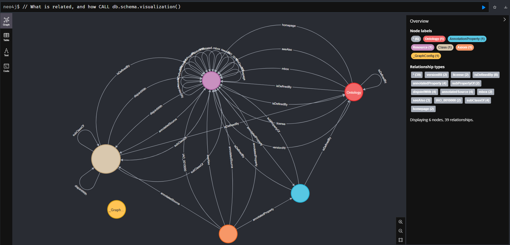

# Testing ontologies and graph database

## Idea
Run test of importing the https://obofoundry.org/ data on a graph database: neo4j. The goal is to allow better understanding of the ontologies structure, namivate thhru the data with a more familiar (for me) query language and interface within neo4j.


## Structure
In the docker folder :

 - a neo4j docker that run a get on the https://neo4j.com/labs/neosemantics/ plugin and a specific config file 
 - a python image that run fastapi to manage different actions on top of the neo4j image
 - a docker compose file

## Usage

### set up
- Clone the repo
- Go to the docker folder  & run 
````
docker compose  up
````

Check that it has installed after few minutes installed and started 2 docker containers : 

````
docker ps

CONTAINER ID   IMAGE                COMMAND                  CREATED          STATUS          PORTS                                                                                            NAMES
fb6c2658e5db   docker-myneo         "/var/lib/neo4j/bin/…"   52 seconds ago   Up 52 seconds   0.0.0.0:7474->7474/tcp, :::7474->7474/tcp, 7473/tcp, 0.0.0.0:7687->7687/tcp, :::7687->7687/tcp   docker-myneo-1
d22e393879bc   docker-ontoservice   "uvicorn main:app --…"   52 seconds ago   Up 52 seconds   0.0.0.0:8000->8000/tcp, :::8000->8000/tcp
````

 - docker-ontoservice is a fast api docker that allow to easilly interact witht he other one
 - docker-myneo is a neo4j server that has the neosemantic plugin installed (but not initialised)

 ### Initialise

 To interact with the neo4j server, you should use the ontoservice API.
 By default : 

````
 $  curl http://localhost:8000
{"Hello":"World"}
````
Now let's call the /init_db endpoint
````
$  curl http://localhost:8000/init_db
{"init":"Done"}
````

### Data loading

We can now use the /add_owl/{onto_code} end point where onto_code is the ontology ID  that can be found in the main obo page https://obofoundry.org/ or in the json version https://obofoundry.org/registry/ontologies.jsonld

Load first the core ontology : 

 ````
$ curl http://localhost:8000/add_owl/bfo
{"added_owl":"bfo"}
````

Then check there are few data on the neo4j by runing
````
$ curl http://localhost:8000/countnode
{"number":262}
````

Or in your neo4j browser : 
````
// Count all nodes
MATCH (n) RETURN count(n)
╒════════╕
│count(n)│
╞════════╡
│262     │
└────────┘

// Count all relationships
MATCH ()-->() RETURN count(*);
╒════════╕
│count(*)│
╞════════╡
│473     │
└────────┘

MATCH (n) RETURN count(labels(n)), labels(n);

╒════════════════╤══════════════════════════════════╕
│count(labels(n))│labels(n)                         │
╞════════════════╪══════════════════════════════════╡
│1               │["_GraphConfig"]                  │
├────────────────┼──────────────────────────────────┤
│85              │["Resource"]                      │
├────────────────┼──────────────────────────────────┤
│118             │["Resource", "Axiom"]             │
├────────────────┼──────────────────────────────────┤
│22              │["Resource", "AnnotationProperty"]│
├────────────────┼──────────────────────────────────┤
│1               │["Resource", "Ontology"]          │
├────────────────┼──────────────────────────────────┤
│35              │["Resource", "Class"]             │
└────────────────┴──────────────────────────────────┘
````

And looking at the graph :  Go to the interface :
````
 http://<docker server>:7474/browser/
````
 Example of BFO ontology


What is related and how ?



 note that by default there is no auth

 Load a typical ontology : chebi

````
$ curl http://localhost:8000/add_owl/chebi
<take a thea>
{"added_owl":"chebi"}
$ curl http://localhost:8000/countnode
{"number":902354}
````

### Optionnal

Remove node that have no labels

````
$ curl http://localhost:8000/delnolabel_owl 
{"remove":"done"}
$ curl http://localhost:8000/countnode
{"number":201056}

````


### Enjoy


MATCH p = (Class {label:'ammonium chloride'})-[r]->(m) return * limit 50

MATCH p = (Class {label:'tartaric acid'})-[r]->(m) return * limit 50


MATCH (n1)-[r]->(n2) where n1.label contains 'cid'  RETURN r, n1, n2 LIMIT 25


